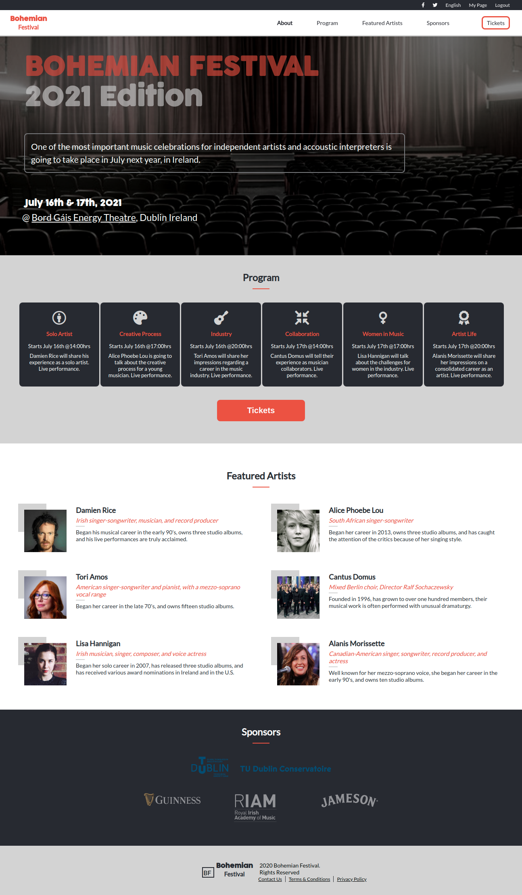
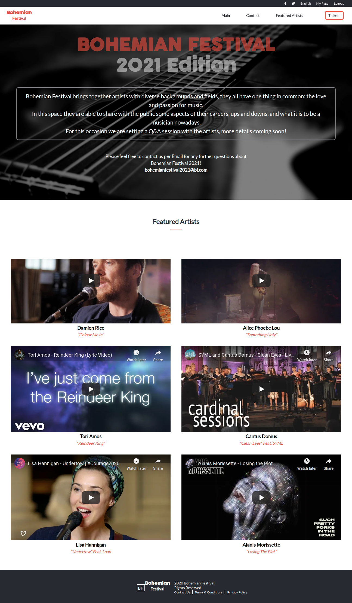
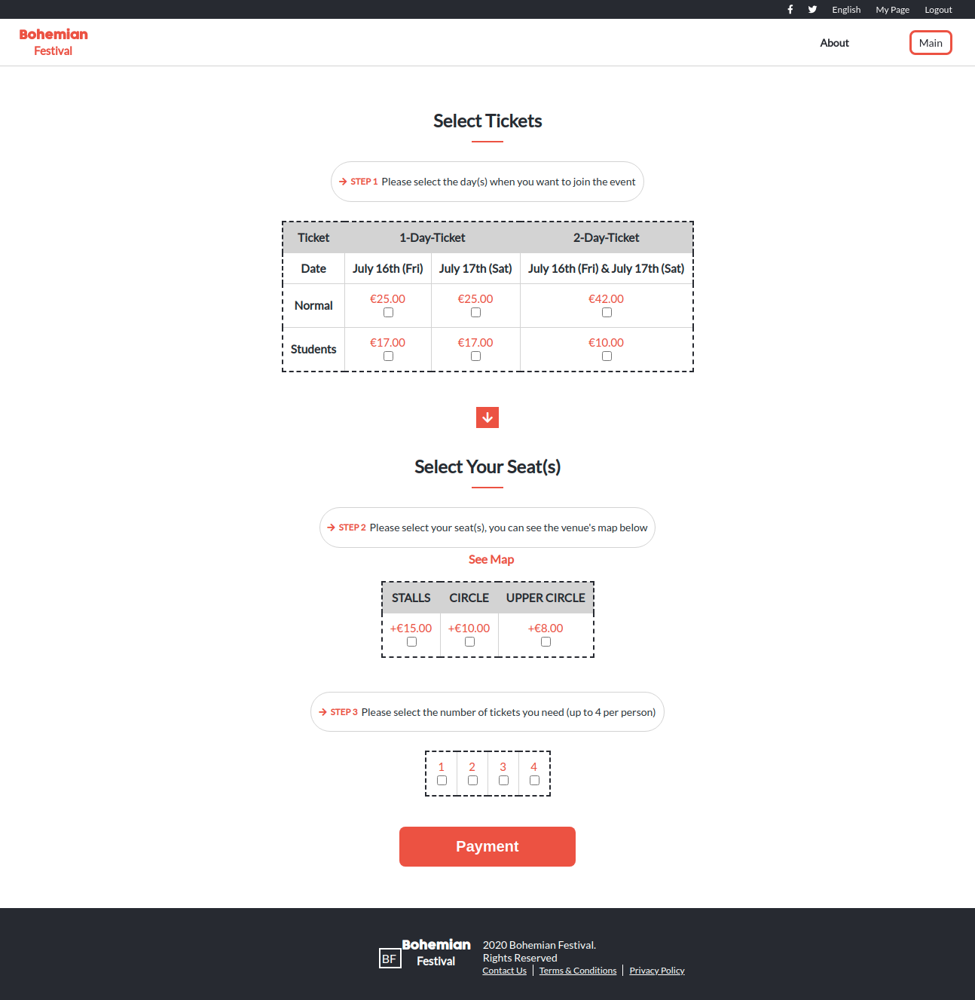

# Capstone-HTML-CSS
Final project for HTML and CSS module

> Online website for a concert built with HTML5 and CSS3

This is part of the first module in Microverse on HTML and CSS, I built a website for a concert based on the design idea of [Cindy Shin](https://www.behance.net/adagio07) - [CC-Global-Summit-2015](https://www.behance.net/gallery/29845175/CC-Global-Summit-2015). 
The page is responsive.
The project is fictional just to reach the requirements, I don't posses any rights for the pictures, logo-brands, videos and artists' names used on it.

----

----

## Built With

- HTML
- CSS

## Live Demo

[Live Demo](https://milypm.github.io/Capstone-HTML-CSS/)

## Contributing

Contributions, issues, and feature requests are welcome!

## Thanks to:

- [W3schools](https://www.w3schools.com/)
- [stackoverflow](https://stackoverflow.com/)
- etc

## Authors

👤 **Mily Puente**

- GitHub: [@bhandle](https://github.com/Milypm)
- LinkedIn: [Mily Puente](https://linkedin.com/in/milypuentem)

## Show your support

Give a ⭐️ if you like this project! Thank you.